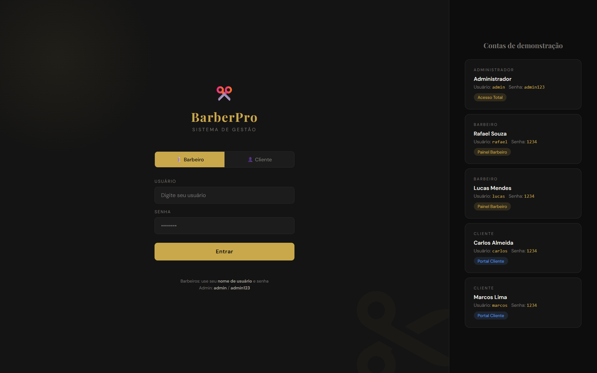
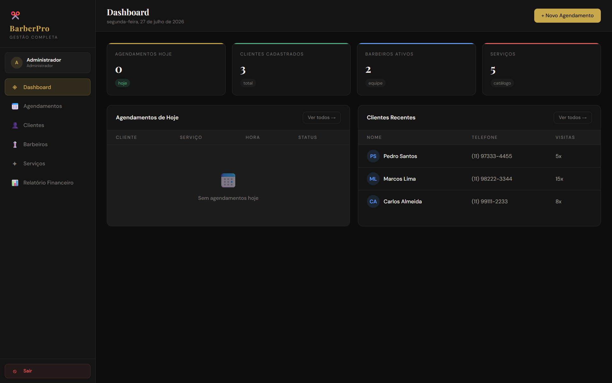
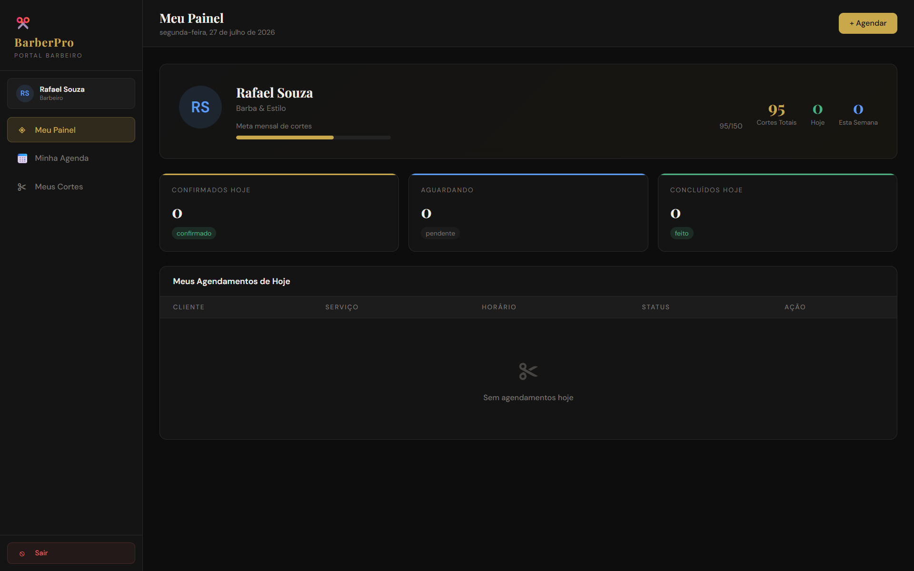

# BarberPro 💈

Sistema completo de gestão para barbearias, com controle de agendamentos, clientes, barbeiros, serviços e relatório financeiro. Desenvolvido como projeto acadêmico para a FATEC.

## 📋 Sobre o projeto

O BarberPro é uma plataforma web com **três níveis de acesso** (Administrador, Barbeiro e Cliente), cada um com um painel próprio. O sistema permite à barbearia gerenciar toda a operação — desde o cadastro de clientes e barbeiros até o controle de agendamentos e faturamento — enquanto o barbeiro acompanha sua agenda e metas individuais.

## 🚀 Funcionalidades

**Painel Administrador**
- Dashboard com visão geral (agendamentos do dia, clientes cadastrados, barbeiros ativos, catálogo de serviços)
- Gestão de agendamentos
- Cadastro e gestão de clientes
- Cadastro e gestão de barbeiros
- Gestão de serviços oferecidos
- Relatório financeiro

**Painel Barbeiro**
- Visão geral do dia (agendamentos confirmados, aguardando e concluídos)
- Acompanhamento de meta mensal de cortes
- Agenda pessoal (Minha Agenda)
- Histórico de cortes realizados (Meus Cortes)

**Painel Cliente**
- Login próprio com portal dedicado

**Sistema de login**
- Autenticação por tipo de usuário (Barbeiro / Cliente), com painéis administrativos separados por permissão

## 🛠️ Tecnologias utilizadas

- **Back-end:** PHP
- **Banco de dados:** MySQL
- **Acesso a dados:** PDO (PHP Data Objects)
- **Front-end:** HTML, CSS, JavaScript
- **Servidor local:** XAMPP
- **Arquitetura:** API REST

## 🗂️ Estrutura do banco de dados

O sistema conta com 5 tabelas relacionais, com lógica de auto-setup (criação automática das tabelas na primeira execução):

- `usuarios` – contas de acesso (admin, barbeiros e clientes) e autenticação
- `clientes` – dados cadastrais dos clientes
- `barbeiros` – dados dos profissionais, incluindo meta mensal de cortes
- `servicos` – catálogo de serviços oferecidos (nome, preço)
- `agendamentos` – relaciona cliente, barbeiro, serviço, horário e status (pendente, confirmado, concluído)

## ⚙️ Como executar o projeto

1. Instale o [XAMPP](https://www.apachefriends.org/)
2. Clone este repositório dentro da pasta `htdocs`:
   ```bash
   git clone https://github.com/Goncalves121/barberPro.git
   ```
3. Inicie o Apache e o MySQL no painel do XAMPP
4. Acesse `http://localhost/barberPro` no navegador
5. O banco de dados é criado automaticamente na primeira execução

### 🔑 Contas de demonstração

| Perfil | Usuário | Senha | Acesso |
|---|---|---|---|
| Administrador | `admin` | `admin123` | Acesso Total |
| Barbeiro | `rafael` | `1234` | Painel Barbeiro |
| Barbeiro | `lucas` | `1234` | Painel Barbeiro |
| Cliente | `carlos` | `1234` | Portal Cliente |
| Cliente | `marcos` | `1234` | Portal Cliente |

## 📸 Demonstração

**Tela de Login**


**Dashboard Administrador**


**Painel do Barbeiro**


## 👤 Autor

**Lucas Gonçalves**
Estudante de Desenvolvimento de Software Multiplataforma – FATEC

[LinkedIn](https://www.linkedin.com/in/lucas-gon%C3%A7alves-718472410/) | [GitHub](https://github.com/Goncalves121)

## 📄 Licença

Projeto desenvolvido para fins acadêmicos.
